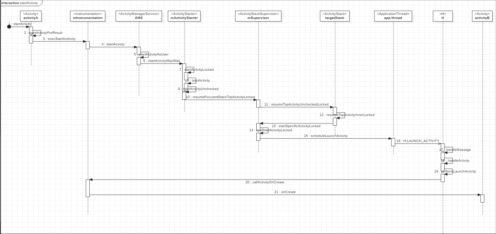

# Activity启动流程

Activity 是一个应用组件，用户可与其提供的屏幕进行交互，以执行拨打电话、拍摄照片、发送电子邮件或查看地图等操作。 每个 Activity 都会获得一个用于绘制其用户界面的窗口。窗口通常会充满屏幕，但也可小于屏幕并浮动在其他窗口之上。

Activity启动的时序图如下(Android 8)：

Activity将消息传递给Instrumentation,由Instrumentation和AMS打交道。
Instrumentation类负责监控系统与应用之间的交互.

ActivityStarter类负责处理Activity的Intent和Flags的逻辑, 还有管理Stack和TaskRecord.

ActivityStackSupervisor与ActivityStack类配合使用. ActivityStackSupervisor负责管理Task和Stack, 而ActivityStack负责管理在Stack和Task中的Activity.

ActivityStackSupervisor#startSpecificActivityLocked方法调用realStartActivityLocked方法，startSpecificActivityLocked方法除了会启动新的Activity外可能会为这个Activity启动一个新的进程`       mService.startProcessLocked(r.processName, r.info.applicationInfo, true, 0,
"activity", r.intent.getComponent(), false, false, true);`

ApplicationTread是ActivityTread的内部类（本地），由他来给个叫H的Handler一个信号，H会调用Instrumentation的方法把Activity用反射的方法new出来，再执行到onCreate
