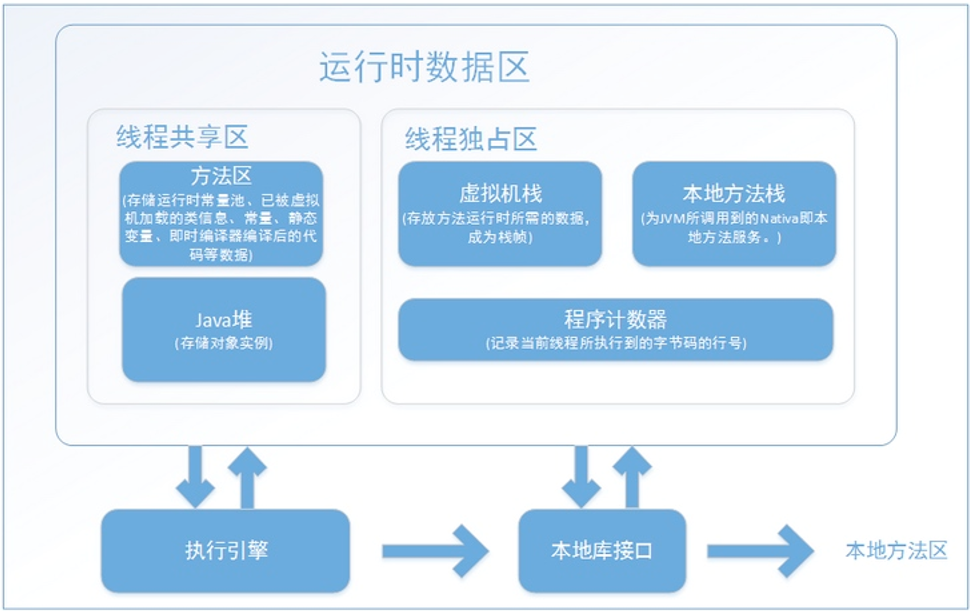
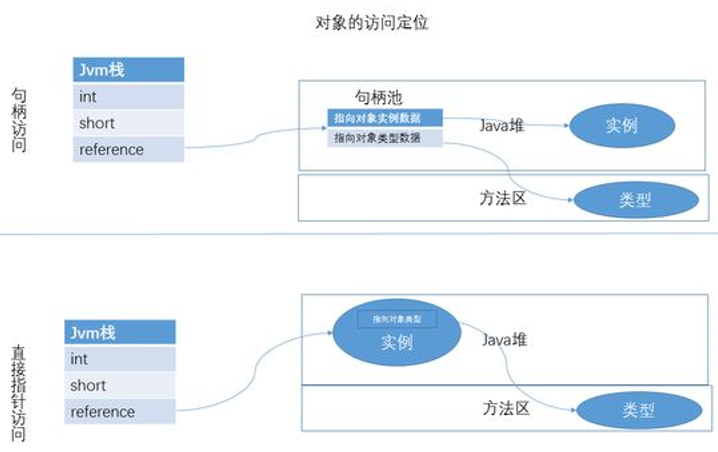
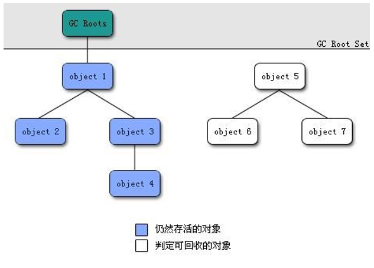
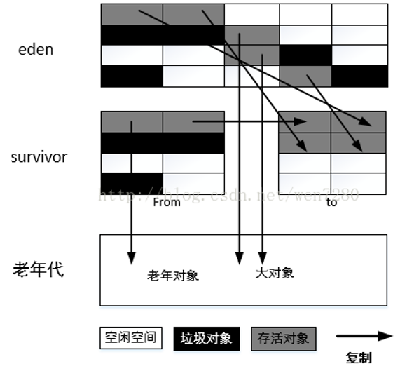
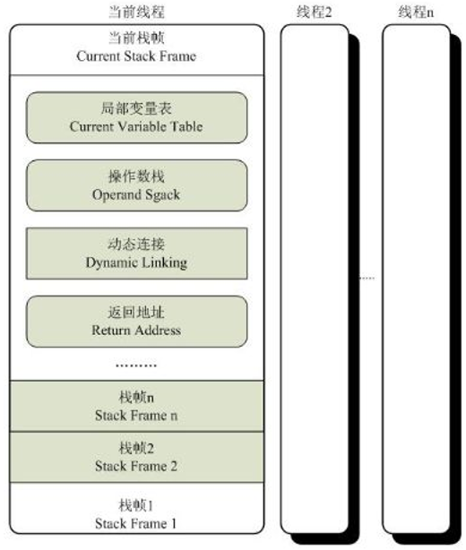

# JVM学习笔记
## 什么是Java虚拟机
Java虚拟机是整个Java平台的基石，是Java技术用以实现硬件无关与操作系统无关的关键部分，是Java语言生成出极小体 积的编译代码的运行平台，是保障用户机器免于恶意代码损害的保护屏障。JVM是一种利用软件方法实现的抽象的计算机基 于下层的操作系统和硬件平台，可以在上面执行java的字节码程序。java编译器只要面向JVM，生成JVM能理解的代码或字 节码文件。Java源文件经编译成字节码程序，通过JVM将每一条指令翻译成不同平台机器码，通过特定平台运行。

Java语言写的源程序通过Java编译器，编译成与平台无关的字节码程序(.class文件)，字节码文件是一种和任何具体机器环境 及操作系统环境无关的中间代码，它是一种二进制文件，是Java源文件由Java编译器编译后生成的目标代码文件。Java解释 器负责将字节码文件翻译成具体硬件环境和操作系统平台下的机器代码，以便执行。因此Java程序不能直接运行在现有的操 作系统平台上，它必须运行在被称为Java虚拟机的软件平台之上。

Java虚拟机（JVM）是运行Java程序的软件环境，Java 解释器就是Java虚拟机的一部分。在运行Java程序时，首先会启动JVM，然 后由它来负责解释执行Java的字节码，并且 Java字节码只能运行于JVM之上。这样利用JVM就可以把Java字节码程序和具体的硬件平台以及操作系统环境分隔开来，只 要在不同的计算机上安装了针对于特定具体平台的JVM，Java程序就可以运行，而不用考虑当前具体的硬件平台及操作系统 环境，也不用考虑字节码文件是在何种平台上生成的。JVM把这种不同软硬件平台的具体差别隐藏起来，从而实现了真正的 二进制代码级的跨平台移植。JVM是Java平台 无关的基础，Java的跨平台特性正是通过在JVM中运行Java程序实现的。

Java的这种运行机Java语言这种“一次编写，到处运行（writeonce，run anywhere）”的方式，有效地解决了目前大多数高 级程序设计语言需要针对不同系统来编译产生不同机器代码的问题，即硬件环境和操作平台的异构问题，大大降低了程序开 发、维护和管理的开销。

## JVM的内存管理机制
Java虚拟机在运行时会将虚拟机管理的内存分成若干块。根据《Java虚拟机规范(Java SE 7版)》的规定，分为以下几块
   

我们知道Java是支持多线程的，所以JVM虚拟机的数据区分为了两大块，一块是所有线程共用
，包括堆（Heap）和方法 区（Method Area）；另一块是各个线程独有的，与线程生命周期一致，包括程序计数器（Program Counter Register）， 虚拟机栈（VM Stack）和本地方法栈。
* __程序计数器__ 程序计数器用来保证程序按照正确地顺序执行，正因为每个线程都有一个自己的程序计数器，所以保证了 程序在不同线程切换时可以恢复到正确的位置。如果程序执行的是Java方法，计数器记录的是正在执行的字节码指令 的地址；如果正在执行的是native方法，则计数器值为空。
* __Java 虚拟机栈__ 描述的是Java方法执行的内存模型，它也是线程私有的。 每个Java method在执行的时候都会创建一个 stack frame用来存储局部变量表、操作数栈、方法出口等信息，每个 Java method的执行过程都对应着一个stack frame从入栈到出栈的过程。 局部变量表 用于存放编译期的各种基本数据类型和对象引用。有 boolean,byte,char,short,int,float,long,double,reference,returnAdress。 局部变量表中的单位为Slot（2^32），除了long和double占用两个Slot其余均占用一个Slot.
* __本地方法栈__ 和虚拟机栈的作用非常相似，他们的区别不过是虚拟机栈为Java method服务，而本地方法栈为Native method服务。
* __Java 堆__ 是Java虚拟机管理的内存中最大的一块，它是被所有线程共享的一块内存区域，在虚拟机启动的时候创建。 此内存区域的目的是存放对象实例，几乎所有的对象实例以及数组都要在堆上分配。Java堆也被称为“GC 堆”（Garbage Collected Heap）。是GC发生的主要区域。Java堆可以处于物理上不连续的内存空间中，只要逻辑上 连续即可。 方法区 与Java堆一样，是各个线程共享的内存区域，用于存储被虚拟机加载的类信息、常量、静态变量、即时编译后 的代码等数据。 运行时常量池 常量池是方法区的一部分。用于存放编译器生成的各种字面量和符号引用，这部分内容 将在类加载后进入方法区的运行时常量池中存放。
* __ 元空间__ 从jdk7开始，就开始了永久代的转移工作，将譬如符号引用(Symbols)转移到了native heap；字面量 (interned strings)转移到了java堆；类的静态变量(class statics)转移到了java堆。但是永久代在还存在于JDK7中，直 到JDK8，永久代才完全消失，转而使用元空间。而元空间是直接存在内存中，不在java虚拟机中的，因此元空间依赖 于内存大小。当然你也可以自定义元空间大小。元空间的本质和永久代类似，都是对JVM规范中方法区的实现。不过 元空间与永久代之间的最大区别在于：元空间并不在虚拟机中，而是使用本地内存。 (http://openjdk.java.net/jeps/122 JEP 122: Remove the Permanent Generation) Java方法如果想访问对象，需要通过reference数据操作来，reference如何定位、访问Java堆中的对象虚拟机规范没有规 定，一般有以下两种主流方式

# 垃圾回收
垃圾回收要考虑三个问题：哪些内存需要回收，什么时候回收，如何回收。
我们先来看第一个问题：
在主流的商用程序语言（Java、C#、甚至更古老的Lisp）的主流实现中都是通过可达性分析来判断对象是否存活。这个算法 的基本思路就是通过一系列名为GC Roots的对象作为起始点，从这些节点开始向下搜索，搜索所走过的路径称为引用链 (Reference Chain)，当一个对象到GC Roots没有任何引用链相连时，则证明此对象是不可用的，下图对象object5, object6, object7虽然有互相判断，但它们到GC Roots是不可达的，所以它们将会判定为是可回收对象。

那么那些点可以作为GC Roots呢？一般来说，如下情况的对象可以作为GC Roots：
* 虚拟机栈(栈桢中的本地变量表)中的引用的对象
* 方法区中的类静态属性引用的对象
* 方法区中的常量引用的对象
* 本地方法栈中JNI（Native方法）的引用的对象

即使在可达性分析算法中的不可达的对象，也并非是“非死不可”的，这个时候它们暂时进入“缓刑”阶段。要真正宣告死亡需 要经历两次标记：如果对象在进行可达性分析后没有与GC Roots相连接的引用链，那它将会被第一次标记并且进行一次筛 选，筛选条件是此对象是否有必要执行finalize()方法。当对象没有覆盖finalize()方法，或者finalize()方法已经被虚拟机调用 过，这两种情况都没必要执行finalize()方法。 如果这个对象被判定为有必要执行finalize()方法，那么这个对象会被放置在一 个叫做F-Queue的队列中。并在稍后由一个由虚拟机自动建立的，低优先级的Finalizer线程去执行它。这里所谓的“执行”是 指虚拟机会触发这个方法，注意如果一个对象的finalize()方法执行缓慢，或者发生了死循环，将可能导致队列中其他对象处 于等待，导致整个内存回收系统崩溃。finalize()方法是对象逃脱死亡命运的最后一次机会，稍后GC将会对F-Queue中的对象 进行第二次小规模标记。

内存回收算法 常见的内存回收算法有以下几种
1. 标记-清除算法： 最基础的垃圾收集算法，算法分为“标记”和“清除”两个阶段：首先标记出所有需要回收的对象，在标记完成之后统一回收掉 所有被标记的对象。
标记-清除算法的缺点有两个：首先，效率问题，标记和清除效率都不高。其次，标记清除之后会产生大量的不连续的内存 碎片，空间碎片太多会导致当程序需要为较大对象分配内存时无法找到足够的连续内存而不得不提前触发另一次垃圾收集动 作。
2. 复制算法：
将可用内存按容量分成大小相等的两块，每次只使用其中一块，当这块内存使用完了，就将还存活的对象复制到另一块内存 上去，然后把使用过的内存空间一次清理掉。这样使得每次都是对其中一块内存进行回收，内存分配时不用考虑内存碎片等 复杂情况，只需要移动堆顶指针，按顺序分配内存即可，实现简单，运行高效。
复制算法的缺点显而易见，可使用的内存降为原来一半。
3. 标记-整理算法： 标记-整理算法在标记-清除算法基础上做了改进，标记阶段是相同的标记出所有需要回收的对象，在标记完成之后不是直接 对可回收对象进行清理，而是让所有存活的对象都向一端移动，在移动过程中清理掉可回收的对象，这个过程叫做整理。
标记-整理算法相比标记-清除算法的优点是内存被整理以后不会产生大量不连续内存碎片问题。 复制算法在对象存活率高的情况下就要执行较多的复制操作，效率将会变低，而在对象存活率高的情况下使用标记-整理算 法效率会大大提高。
4. 分代收集算法：
根据内存中对象的存活周期不同，将内存划分为几块，java的虚拟机中一般把内存划分为新生代和年老代，当新创建对象时 一般在新生代中分配内存空间，当新生代垃圾收集器回收几次之后仍然存活的对象会被移动到年老代内存中，当大对象在新 生代中无法找到足够的连续内存时也直接在年老代中创建。

堆内存被分成新生代和年老代两个部分，整个堆内存使用分代复制垃圾收集算法。
1. 新生代： 新生代使用复制和标记-清除垃圾收集算法，研究表明，新生代中98%的对象是朝生夕死的短生命周期对象，所以不需要将 新生代划分为容量大小相等的两部分内存，而是将新生代分为Eden区，Survivor from和Survivor to三部分，其占新生代内存 容量默认比例分别为8：1：1，其中Survivor from和Survivor to总有一个区域是空白，只有Eden和其中一个Survivor总共 90%的新生代容量用于为新创建的对象分配内存，只有10%的Survivor内存浪费，当新生代内存空间不足需要进行垃圾回收 时，仍然存活的对象被复制到空白的Survivor内存区域中，Eden和非空白的Survivor进行标记-清理回收，两个Survivor区域 是轮换的。
新生代中98%情况下空白Survivor都可以存放垃圾回收时仍然存活的对象，2%的极端情况下，如果空白Survivor空间无法存 放下仍然存活的对象时，使用内存分配担保机制，直接将新生代依然存活的对象复制到年老代内存中，同时对于创建大对象 时，如果新生代中无足够的连续内存时，也直接在年老代中分配内存空间。
Java虚拟机对新生代的垃圾回收称为Minor GC，次数比较频繁，每次回收时间也比较短。 使用java虚拟机-Xmn参数可以指定新生代内存大小。
2. 年老代： 年老代中的对象一般都是长生命周期对象，对象的存活率比较高，因此在年老代中使用标记-整理垃圾回收算法。 Java虚拟机对年老代的垃圾回收称为MajorGC/Full GC，次数相对比较少，每次回收的时间也比较长。
当新生代中无足够空间为对象创建分配内存，年老代中内存回收也无法回收到足够的内存空间，并且新生代和年老代空间无 法在扩展时，堆就会产生OutOfMemoryError异常。 java虚拟机-Xms参数可以指定最小内存大小，-Xmx参数可以指定最大内存大小，这两个参数分别减去Xmn参数指定的新生 代内存大小，可以计算出年老代最小和最大内存容量。

## 虚拟机字节码执行引擎
栈帧（Stack Frame）是用于支持虚拟机进行方法调用和方法执行的数据结构，它是虚拟机运行时数据区中的虚拟机栈 （Virtual Machine Stack）的栈元素。栈帧存储了方法的局部变量表、操作数栈、动态连接和方法返回地址等信息。每一个 方法从调用开始至执行完成的过程，都对应着一个栈帧在虚拟机栈里面从入栈到出栈的过程。

每一个栈帧都包括了局部变量表、操作数栈、动态连接、方法返回地址和一些额外的附加信息。在编译程序代码的时候，栈 帧中需要多大的局部变量表，多深的操作数栈都已经完全确定了，并且写入到方法表的 Code 属性之中，因此一个栈帧需要 分配多少内存，不会受到程序运行期变量数据的影响，而仅仅取决于具体的虚拟机实现。

局部变量表 　
  用于存放方法参数和方法内部定义的局变量，Class文件中方法的Code属性的max_locals确定了该方法所需要分配的局 部变量表的最大容量。局部变量表的容量以变量槽（Variable Slot）为最小单位，虚拟机规范中并没有明确指明一个Slot应 占用的内存空间大小，只是规定一个Slot应该能存放一个boolean、byte、char、short、int、float、reference或 returnAddress类型的数据。 　　
  对于64位的数据类型，虚拟机会以高位对齐的方式为其分配两个连续的Slot空间。 　　
  虚拟机通过索引定位（类似数组）的方式使用局部变量表。 　　
  如果执行的是实例方法（非static），那局部变量表中第0个索引的Slot默认适用于传递方法所属独享实例的引用，在方 法中可以通过关键字“this”来访问这个隐含的参数。

操作数栈 　　
  和局部变量区一样，操作数栈也是被组织成一个以字长为单位的数组。但是和前者不同的是，它不是通过索引来访问， 而是通过标准的栈操作—压栈和出栈—来访问的。比如，如果某个指令把一个值压入到操作数栈中，稍后另一个指令就可以 弹出这个值来使用。 　　
  Java虚拟机的解释执行引擎称为“基于栈的执行引擎”，其中所指的“栈”就是操作数栈。

动态连接 　　
  每个栈帧都包含一个指向运行时常量池中该栈帧所属方法的引用，持有这个引用是为了支持方法调用过程中的动态连接 （Dynamic Linking）。我们知道Class文件的常量池中存有大量的符号引用，字节码中的方法调用指令就以常量池中指向方 法的符号引用作为参数。这些符号引用一部分会在类加载阶段或者第一次使用的时候就转化为直接引用，这种转化称为静态 解析。另外一部分将在每一次运行期间转化为直接引用，这部分称为动态连接。

方法返回地址 　　
  方法有两种退出方式：return，或者是抛出异常未被捕获。 　　
  无论以何种方式退出，都需要返回到方法被调用的位置，程序才能继续执行。方法返回时可能需要在栈帧中保存一些信 息，用来帮助恢复它的上层方法的执行状态。一般来说，方法正常退出时，调用者PC计数器的值就可以作为返回地址，栈 帧中很可能会保存这个计数器值。

方法调用
  方法调用并不等同于方法执行,方法调用阶段唯一的任务就是确定被调用方法的版本(即调用哪一个方法),暂时还不涉及方法内 部的具体运行过程。在程序运行时,进行方法调用是最普遍、最频繁的操作,但前面已经讲过,Class文件的编译过程中不包含 传统编译中的连接步骤,一 切方法调用在Class文件里面存储的都只是符号引用,而不是方法在实际运行时内存布局中的入口 地址(相当于之前说的直接引用)。这个特性给Java带来了更强大的动态扩展能力,但也使得Java方法调用过程变得相对复杂起 来,需要在类加载期间,甚至到运行期间才能确定目标方法的直接引用。 解析 继续前面关于方法调用的话题，所有方法调用中的目标方法在Class文件里面都是一个常量池中的符号引用，在类加载的解 析阶段，会将其中的一部分符号引用转化为直接引用，这种解析能成立的前提是：方法在程序真正运行之前就有一个确定的 调用版本，并且这个方法的调用版本在运行期是不可改变的。换句话说，调用目标在程序代码写好、编译器进行编译时就必 须确定下来。这类方法的调用称为解析（Resolution）。 在Java语言中符合“编译器可知，运行期不可变”这个要求的方法，主要包括静态方法和私有方法两大类。 与之相对应的是,在Java虚拟机里面提供了5条方法调用字节码指令,分别如下。
  > invokestatic :调用静态方法。
  > invokespecial :调用实例构造器方法、私有方法和父类方法。
  > invokevirtual :调用所有的虚方法。
  > invokeinterface :调用接口方法,会在运行时再确定一个实现此接口的对象。
  > invokedynamic :先在运行时动态解析出调用点限定符所引用的方法,然后再执行该方法  

  在此之前的4条调用指令,分派逻辑是固化在Java虚拟机内部的,而invokedynamic指令的分派逻辑是由用户所设定的引导方法决定的。 解析调用一定是个静态的过程,在编译期间就完全确定,在类装载的解析阶段就会把涉及的符号引用全部转变为可确定的直接 引用,不会延迟到运行期再去完成。而分派(Dispatch)调用则可能是静态的也可能是动态的,根据分派依据的宗量数可分为单分派和多分派。

分派
  众所周知,Java是一门面向对象的程序语言,因为Java具备面向对象的3个基本特征:继承、封装和多态。本节讲解的分派调用 过程将会揭示多态性特征的一些最基本的体现, 如“重载”和“重写”在Java虚拟机之中是如何实现的,这里的实现当然不是语法 上该如何写, 我们关心的依然是虚拟机如何确定正确的目标方法。 重载时是通过参数的静态类型而不是实际类型作为判定依据的。所有依赖静态类型来定位方法执行版本的分派动作称为静态 分派。静态分派的典型应用是方法重载。静态分派发生在编译阶段,因此确定静态分派的动作实际上不是由虚拟机来执行的。 另外 ,编译器虽然能确定出方法的重载版本,但在很多情况下这个重载版本并不 是“唯一的” ,往往只能确定一个“更加合适 的”版本。 动态分派的一个最直接的例子是重写。对于重写，我们已经很熟悉了，那么Java虚拟机是如何在程序运行期间确定方法的执 行版本的呢？

  解释这个现象，就不得不涉及Java虚拟机的invokevirtual指令了，这个指令的解析过程有助于我们更深刻理解重写的本质。 该指令的具体解析过程如下：

    找到操作数栈栈顶的第一个元素所指向的对象的实际类型，记为C 如果在类型C中找到与常量中描述符和简单名称都相符的方法，则进行访问权限的校验，如果通过则返回这个方法的直接引 用，查找结束；如果不通过，则返回非法访问异常 如果在类型C中没有找到，则按照继承关系从下到上依次对C的各个父类进行第2步的搜索和验证过程 如果始终没有找到合适的方法，则抛出抽象方法错误的异常

    从这个过程可以发现，在第一步的时候就在运行期确定接收对象（执行方法的所有者程称为接受者）的实际类型，所以当调 用invokevirtual指令就会把运行时常量池中符号引用解析为不同的直接引用，这就是方法重写的本质。

3.虚拟机动态分派的实现 其实上面的叙述已经把虚拟机重写与重载的本质讲清楚了，那么Java虚拟机是如何做到这点的呢？

由于动态分派是非常频繁的操作，实际实现中不可能真正如此实现。Java虚拟机是通过“稳定优化”的手段——在方法区中建 立一个虚方法表（Virtual Method Table），通过使用方法表的索引来代替元数据查找以提高性能。虚方法表中存放着各个方 法的实际入口地址（由于Java虚拟机自己建立并维护的方法表，所以没有必要使用符号引用，那不是跟自己过不去嘛），如 果子类没有覆盖父类的方法，那么子类的虚方法表里面的地址入口与父类是一致的；如果重写父类的方法，那么子类的方法 表的地址将会替换为子类实现版本的地址。

方法表是在类加载的连接阶段（验证、准备、解析）进行初始化，准备了子类的初始化值后，虚拟机会把该类的虚方法表也 进行初始化。
