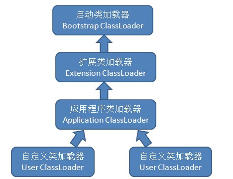
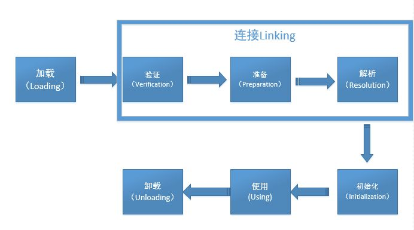

# JVM虚拟机之ClassLoader

## 什么是ClassLoader
[这里有甲骨文公司对ClassLoader的解释](https://docs.oracle.com/javase/8/docs/api/java/lang/ClassLoader.html)，这里我们摘取一些我认为重要的内容：

>_A class loader is an object that is responsible for loading classes._  
>__类加载器是一个负责加载类的对象。__

* 这里Load的不一定是本地文件，也可能是从网络或者其他地方的一个二进制流。

>_Every Class object contains a reference to the ClassLoader that defined it._  
>__每个Class对象都包含对定义它的ClassLoader的引用。__  

* xxx.class.getClassLoader()
* ClassLoader不一定是Java类，对于Java类型的ClassLoader，引用指向他的父ClassLoader。第一个ClassLoader是个C++对象;

>_The ClassLoader class uses a delegation model to search for classes and resources._  
>__ClassLoader类使用委派模型来搜索类和资源。__  

  
* Bootstrap ClassLoader：最顶层的加载类，主要加载核心类库，%JRE_HOME%\lib下的rt.jar、resources.jar、charsets.jar和class等；
* Extention ClassLoader：扩展的类加载器，加载目录%JRE_HOME%\lib\ext目录下的jar包和class文件；
* Appclass Loader：加载当前应用的classpath的所有类；
* JVM加载一个class时先查看是否已经加载过，没有则通过父加载器，然后递归下去，直到BootstrapClassLoader，如果BootstrapClassloader找到了，直接返回，如果没有找到，则一级一级返回（查看规定加载路径），最后到达自身去查找这些对象。这种机制就叫做双亲委托。（一会儿我们还会讲到）

## 类加载
1. 什么是类加载？  
 虚拟机把描述类的数据从Class文件加载到内存，并对数据进行校验，转换解析和初始化，最终形成可以被虚拟机直接使用的JAVA类型，这就是虚拟机的类加载机制。  
   
 * 加载：1.通过一个类的全限定名来获取定义此类的二进制文件；2.将这个字节流所代表的静态存储结构转化为方法区的运行时数据结构；3.在内存中生成一个代表这个类的java.lang.Class对象，作为这个类的各种数据的访问入口   
 * 验证：魔数，java版本……   
 `public static int value = 123;`  
 * 准备：正式为类变量分配内存，并设置初始值 value = 0。  
 * 解析：符号引用变为直接引用 。
 * 初始化：value = 123。

2. 什么时候类加载？  
 Java虚拟机规范规定了类的生命周期和类初始化的时机。其中加载到初始化是我们说的类加载的最后一步:
 1. 使用new关键字实例化对象的时候、读取或设置一个类的静态字段的时候，已经调用一个类的静态方法的时候。
 2. 使用java.lang.reflect包的方法对类进行反射调用的时候，如果类没有初始化，则需要先触发其初始化。
 3. 当初始化一个类的时候，如果发现其父类没有被初始化就会先初始化它的父类。
 4. 当虚拟机启动的时候，用户需要指定一个要执行的主类（就是包含main()方法的那个类），虚拟机会先初始化这个类；
 5. 使用Jdk1.7动态语言支持的时候的一些情况。  

 ## 类加载器与类
 类加载器虽然只用于实现类的加载动作，但它在Java程序中起到的作用却远远不限于类加载阶段。
 ___对于任意一个类，都需要加载它的类加载器和这个类本身一同确立其在Java虚拟机中的唯一性。___ 这句话可以表达的更通俗一些：比较两个类是否“相等”，只有在这两个类是由同一个类加载器加载的前提下才有意义，否则，即使这两个类是来源于同一个Class文件，只要加载它们的类加载器不同，那这两个类就必定不相等。
 ``` Java
 ClassLoader cl = newLoader();
 Class<?> cls = cl.loadClass("chenhao.sun.LeetCode");
 Class<?> cls1 = cl.loadClass("chenhao.sun.LeetCode");
 System.out.println(cls.equals(cls1));

 ClassLoader cl2 = newLoader();
 Class<?> cls2 = cl2.loadClass("chenhao.sun.LeetCode");
 System.out.println(cls.equals(cls2));
```  
 对于cls1,在load的时候会先去查找是否已经load出来这个类，如果已经load出来则直接使用，所以第一个结果为真  
上面的cl和cl2分别是两个不同的classloader，虽然cl已经load过一次LeetCode类，但cl2并没有，所以cl2需要再load一次，所以第二个为假。（_类的唯一性，依赖于ClassLoader，所以统一进程下，同一个类文件的静态变量也可能不同（单例不单）_）

## 双亲委派模型
  
双亲委派模型的工作过程是：如果一个类加载器(当前类的加载器)收到了类加载请求，它首先不会自己去加载这个类，而是将这个类委托给父加载器去完成，每一层加载器都是如此，因此所有加载请求最终应该传送到顶层的启动类加载器中，只有父加载器反馈无法加载时，子加载器才会自己尝试去加载。  
* BoostStrap实际上是Java虚拟机的一部分，他负责加载Java中最基础的一些类如Object.class
* BoostStrap又加载出ExtensionClassLoader。
* ExtensionClassLoader会加载一些扩展的类比如提供一些加密算法。
* Extension加载出AppClassLoader，自此我们可以执行我们的入口main()方法了

__为什么要采用双亲委派模型?__
1. 不同的ClassLoader加载不同位置的class文件
2. 采用双亲委派模型确保的一条线上的类不被重复加载（比如Object类不会有多个）

__双亲委托模型并不是强制的（实际上有更复杂的网状模型），但在Android上我们可以认为就是双亲委派模型。__

## ClassLoader花样
* 热部署、插件化……
* 减少包大小……，一个dex方法不能超过65535，补丁……
* Google MultiDex  
  360 DroidPlugin  
  阿里 AndFix  
  ……
