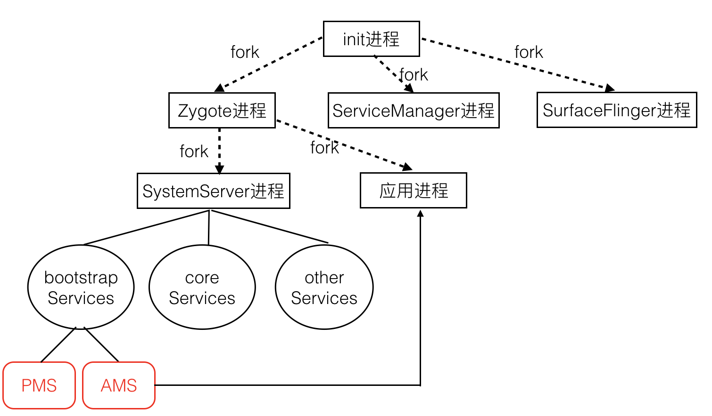
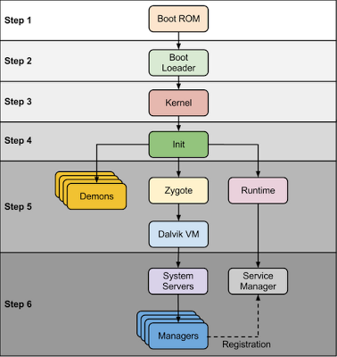
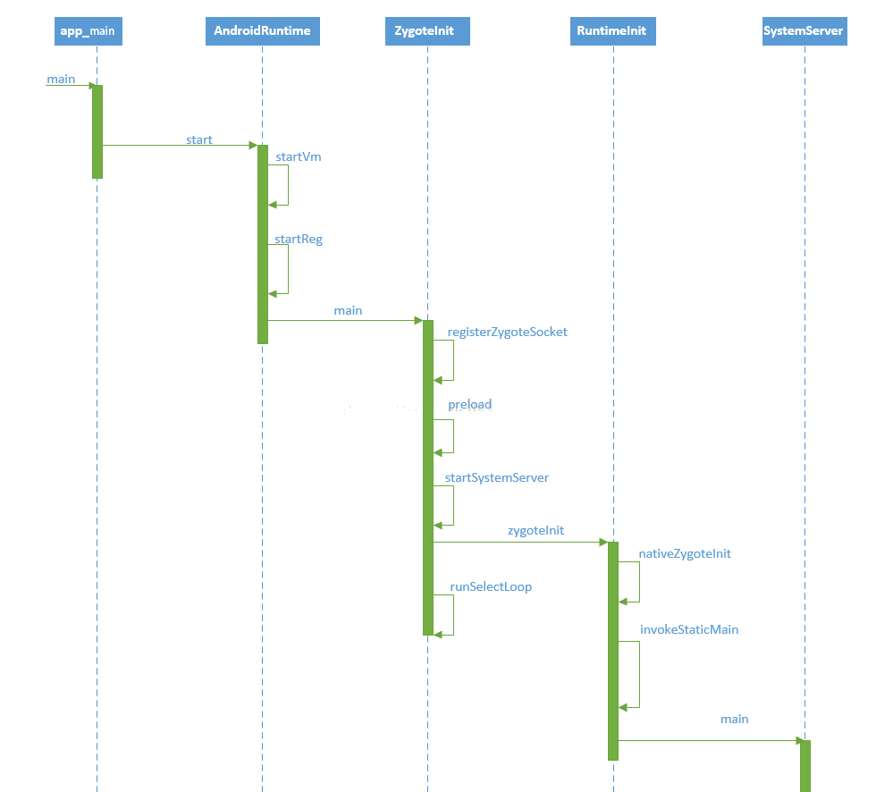
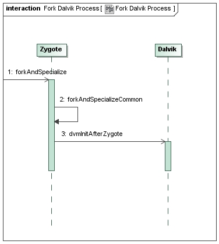

# Zygote Fork机制与资源预加载
---
在我们做AMS,PMS等分享的时候都有提到过zygote,那么zygote是什么呢？

zygote中文意思是受精卵，
通过这个名字我们大概可以知道，安卓团队大概是通过他孵化什么东西，
那么问题来了。他的父母是谁？他孵化成了了什么？孵化过程中又做了什么？

再次祭上图：

由图我们可以看出，他的父进程是init进程，他孵化了SystemServer进程，以及我们的应用进程。
下面我们重点看一看zygote是怎么工作的：

## Zygote进程创建
__从上图可以看出zygote是由init进程fork出来的。__
我们知道Android是基于Linux实现的。而init进程是Linux启动后的第一个用户进程。下图为我们展示了
android启动的过程

上图中Step1~Step4都发生在Linux中，与Android没多大关系，Step5开始才正式开始构建Android
世界。我们接下来以Android 8系统源码为例看看Step4是过渡到Step5的。

linunx的init进程会执行到\\android-8.0.0_r1\\system\\core\\init\\init.cpp中，init.cpp
会读取init.rc文件\\android-8.0.0_r1\\system\\core\\rootdir\\init.rc文件，然后依据配
置创建新线程并执行相应的代码（surfaceflinger中会有讲到），其中有一条配置指向
\\android-8.0.0_r1\\frameworks\\base\\cmds\\app_process\\app_main.cpp，这个就是我们zygote的开始

## Zygote孵化SystemServer和其他进程
祭上一张zygote时序图

* 上图中app_main和AndroidRuntime是native层的，其余的是Java层的。
* 在nativeZygoteInit中完成Binder服务初始化。这时候Binder才可以使用。（SystemServer进程）
  （_在fork出新线程后做的第一件事就是关闭socket，如果采用Binder直接拿着地址是不是会有安全问题_）
* runSelectLoop进入死循环等待fork新进程的请求。
* preload预加载了一些可能会用到的类和资源比如说

 

## AMS请求Zygote fork一个新进程
当AMS判断需要一个新进程是会执行到startProcessLocked（）与Zygote通信。
Zygote收到后会调用Zygote.forkAndSpecialize(),fork一个新进程，并且分叉

 

 分叉后的进程会将socket停掉并重新初始化一些数据但是，preload的资源和类保和VM留了下来,
 自此新的进程和zygote进程分道扬镳。

 ## 思考题
 1. preload的那些资源我们可以直接使用吗？
 2. 为什么SurfaceFlinger, ServiceManager不用zygote fork。用zygote fork有什么优势？
